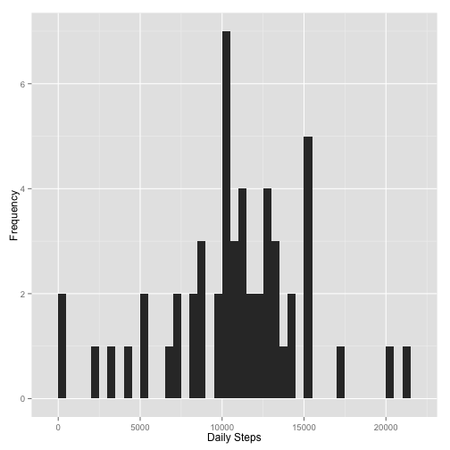
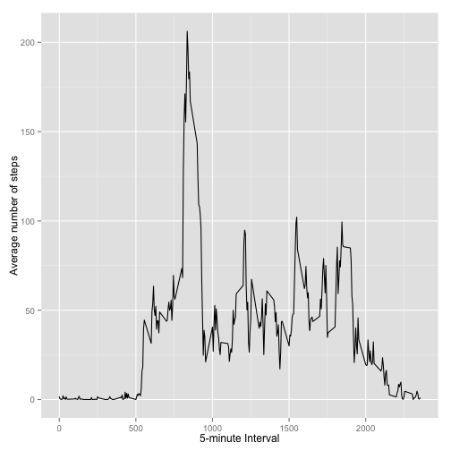
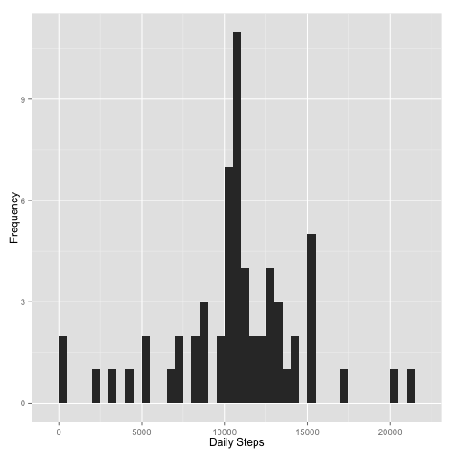

Reproducible Research - Peer Assessment 1
========================================================

Preparation :

The dataset Activity monitoring data is pre-downloaded from the link 
provided in the assignment. The zip file is opened and the data file
activity.csv is extracted and placed in the R working direction.

## Loading and preprocessing the data
Load the data from dataset Activity monitoring data


```r
activity <- read.csv("activity.csv", colClasses = "character", 
                     na.strings=c("Not Available","NA"))
```

Change the column steps and interval to numeric and
get the total number of steps taken each day.
The missing steps values are ignored.


```r
activity$steps <- as.numeric(activity$steps)

activity$interval <- as.numeric(activity$interval)

library(plyr)

activityDaily <- aggregate(steps ~ date, data = na.omit(activity), FUN = sum)
```

## What is mean total number of steps taken per day?

Make a histogram of the total number of steps taken each day and
calculate and report the mean and median total number of steps taken
per day.


```r
library(ggplot2)

ggplot(data=activityDaily, aes(x=steps)) + geom_histogram(binwidth=500) +
        xlab("Daily Steps") + ylab("Frequency")
```

 

```r
meanSteps <- mean(activityDaily$steps)

medianSteps <- median(activityDaily$steps)

cat("The mean total number of steps taken per day: ", meanSteps)
```

```
## The mean total number of steps taken per day:  10766
```

```r
cat("The median total number of steps taken per day: ", medianSteps)
```

```
## The median total number of steps taken per day:  10765
```

## What is the average daily activity pattern?

Get the average number of steps taken per 5-minute interval across all days.
The missing steps values are ignored.
Make a time series plot of the 5-minute interval (x-axis) and the average number
of steps taken, average across all days (y-axis)


```r
activityInt <- aggregate(steps ~ interval, data = na.omit(activity), FUN = mean)

ggplot(data=activityInt, aes(x=interval, y=steps)) + geom_line() +
        xlab("5-minute Interval") + ylab("Average number of steps")
```

 

```r
maxSteps <- activityInt[activityInt$steps == max(activityInt$steps), 1]

cat("The 5-minute interval containing the maximum number of steps is ", maxSteps)
```

```
## The 5-minute interval containing the maximum number of steps is  835
```

## Imputing missing values

Calculate the total number of missing values in the dataset.


```r
naRow <- nrow(activity[!complete.cases(activity),])

cat("Total number of missing values in the dataset is ", naRow)
```

```
## Total number of missing values in the dataset is  2304
```

Use the mean for the 5-minute interval to fill in the missing steps value for that
interval.
To get the corresponding interval mean by joining the original dataset with the
original dataset with 5-minute interval means dataset.
The missing steps values are replaced by the average 5-minute interval means.


```r
activityI <- join(activity, activityInt, by = "interval", type = "left")

colnames(activityI) <- c("steps", "date", "interval", "intAvg")

activityI$steps <- ifelse(is.na(activityI$steps), activityI$intAvg, activity$steps)
```

Get the total number of steps taken each day.
Use the new dataset with no missing steps values to make a histgram of the total number of steps taken each day.


```r
activityIDaily <- aggregate(steps ~ date, data = activityI, FUN = sum)
ggplot(data=activityIDaily, aes(x=steps)) + geom_histogram(binwidth=500) +
        xlab("Daily Steps") + ylab("Frequency")
```

 

Calculate the mean and median total number of steps taken per day.


```r
meanISteps <- mean(activityIDaily$steps)

medianISteps <- median(activityIDaily$steps)

cat("The mean total number of steps taken per day (missing values replaced):", meanISteps)
```

```
## The mean total number of steps taken per day (missing values replaced): 10766
```

```r
cat("The median total number of steps taken per day (missing values replaced):", medianISteps)
```

```
## The median total number of steps taken per day (missing values replaced): 10766
```

The mean total number of steps taken per day:  10766
The median total number of steps taken per day:  10765
The mean total number of steps taken per day (missing values replaced): 10766
The median total number of steps taken per day (missing values replaced): 10766

Impact of imputing the missing data:

The mean total number of steps taken per day is the same between the original
dataset and the dataset with missing values replaced.

The median total numbe of the steps taken per day is only 1 difference between
the original dataset and the dataset with missing values replaced.

After imputing missing data on the estimates of the total daily number of 
steps, the frequencies of several daily steps have increased. Those are the 
date with missing data.

## Are there differences in activity patterns betweeb weekdays and weekends?

Create a new factor variable in the dataset with two levels - "weekday" and 
"weekend" indicating whether a given date is a weekday or weekend day.


```r
activityI$day <- weekdays(as.Date(activityI$date))

activityI$weekday <- ifelse(activityI$day == "Saturday" | activityI$day == "Sunday", "weekend", "weekday")

activityI$weekday <- as.factor(activityI$weekday)
```

Calculate the average number of steps taken, average across all weekday days and
weekend days
Make a panel of plot containing a time series plot of the 5-minute interval
(x-axis) and the average number of steps taken calculated in the pervious step
(y-axis).


```r
activityIInt <- aggregate(steps ~ interval + weekday, data = activityI, FUN = mean)

library(lattice) 

xyplot(steps ~ interval | weekday, data = activityIInt, type = "l", 
       xlab = "Interval", ylab = "Number of steps", layout = c(1,2))
```

 

The differences in activity patterns between weekdays and weekends :

The object is active eariler in the weekdays than in the weekends. The object 
has a spike (over 200 steps) in activity around interval 800 in the weekday. 
During weekends, the spike around interval 800 is smaller (less than 180 steps).
The overall number of steps after interval 1000 is higher during the weekends and
goes down after interval 1600. The number of steps goes down repaidly after interval
1800 during weekdays.

